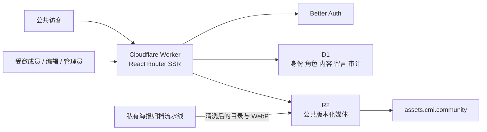

# CMI 官网架构

## 目标

官网不是海报 demo 的放大版，而是一个可以逐步承载社区身份、内容发布、公共档案、反馈和实验的长期平台。地基版本只迁移已经验证的海报体验，同时固定数据、权限和发布边界。

## 运行结构

## 模块

- `identity`：账号、资料、邀请和角色；认证实现位于 Worker 服务端。
- `publishing`：内容条目、草稿、revision、发布审计与公共字段投影。
- `media`：R2 资产登记、受权上传和公共 URL。
- `poster-wall`：历史海报展示、LOFI、详情和留言，是当前 demo 模块。
- `feedback`：匿名社区信号、投票和滥用限制。
- `experiments`：未来可撤销实验，不得绕过身份、内容或审计边界。
- `shared`：只容纳设计系统、权限策略、Cloudflare 上下文、数据库和可观测性。

模块不得直接把数据库行返回给公共客户端。公共投影使用显式白名单；身份、内部分类、来源判断、授权状态、本地路径和哈希默认都不是公共字段。

## 路由与语言

中文为默认且没有语言前缀。英文空间保留在 `/en/*`，但地基版本不制造不存在的英文内容。根路径使用 308 跳转到 `/archive/posters`，等真正首页准备好再通过 ADR 修改。

## 内容的唯一真相源

固定政策、品牌边界、隐私与开发文档保存在仓库。活动、故事、共同记忆等运营内容进入 D1 后，以 D1 为唯一发布源。仓库 Markdown 不建立第二份运营内容真相。

## 权限

`member < editor < moderator < admin`。所有授权在 Worker 中检查：member 只读自己的资料，editor 管理草稿和媒体，moderator 具有编辑级平台权限并承接治理扩展，只有 admin 可以邀请、授权和发布。界面隐藏不构成授权。

## 发布与回滚

PR 必须通过 `foundation` 检查。`main` 自动部署 staging；production GitHub Environment 需要人工批准。新 Worker 接管生产后，旧 Worker 与旧 D1 在稳定观察期保持可回滚且不删除。
